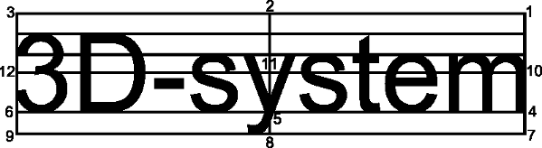

Drawing tools
=============

Available drawing tools.

Drawing methods
---------------

All drawing methods behave same way. Pressing the mouse button defines starting point. Moving mouse while pressing the button changes end point and draws item in real time. Releasing the button creates new item to the symbol and makes it active item.

Item start and end points must be different. Releasing the mouse button at start point does not create new item.

|select image| Select
^^^^^^^^^^^^^^^^^^^^^

Activates nearest pointed item. Areas are selected by pointing the perimeter and texts are selected by pointing the anchor point.

.. |line image| image:: ../../image/polyline.png
	:scale: 50 %

|line image| Line
^^^^^^^^^^^^^^^^^

Draws two point line. Successive two point lines form polyline and closing polyline to the starting point forms polygon.

.. |rect corner image| image:: ../../image/rectangle_corner.png
	:scale: 50 %

|rect corner image| Rectangle corner
^^^^^^^^^^^^^^^^^^^^^^^^^^^^^^^^^^^^^^^^

Draws rectangle between two diagonal corners.

|rect center image| Rectangle center
^^^^^^^^^^^^^^^^^^^^^^^^^^^^^^^^^^^^^^^^

Draws rectangle from center to corner.

.. |circle corner image| image:: ../../image/circle_corner.png
	:scale: 50 %
.. |circle diameter image| image:: ../../image/circle_diameter.png
	:scale: 50 %
.. |circle center image| image:: ../../image/circle_center.png
	:scale: 50 %

|circle corner image| Circle corner
^^^^^^^^^^^^^^^^^^^^^^^^^^^^^^^^^^^^^

Draws circle inside rectangle given with two diagonal corners.

|circle diameter image| Circle diameter
^^^^^^^^^^^^^^^^^^^^^^^^^^^^^^^^^^^^^^^^^

Draws circle between two diameter endpoints.

|circle center image| Circle center
^^^^^^^^^^^^^^^^^^^^^^^^^^^^^^^^^^^^^

Draws circle with center and radius.

.. |arc semi image| image:: ../../image/semi_diameter.png
	:scale: 50 %
.. |arc quarter image| image:: ../../image/quarter_radius.png
	:scale: 50 %

.. xxx |arc semi image| Semicircle
.. xxx ^^^^^^^^^^^^^^^^^^^^^^^^^^^

.. xxx Draws semicircle between two diameter endpoints.

.. xxx |arc quarter image| Quarter circle
.. xxx ^^^^^^^^^^^^^^^^^^^^^^^^^^^^^^^^^^

.. xxx Draws quarter circle with center and radius.

.. |text horizontal image| image:: ../../image/text_horizontal.png
	:scale: 50 %

|text horizontal image| Horizontal text
^^^^^^^^^^^^^^^^^^^^^^^^^^^^^^^^^^^^^^^

Draws horizontal text to given position.

|text rotated image| Rotated text
^^^^^^^^^^^^^^^^^^^^^^^^^^^^^^^^^

Draws text to given position using other point as direction.

Settings
--------

Upper line settings affect only symbol editor. Lower line settings are stored with symbol.

Grid Snap
^^^^^^^^^

Grid snap in editing.

Line width
^^^^^^^^^^

Line width in editing.

Symbol size
^^^^^^^^^^^

Symbol size in millimeters or meters in editing. Assumes scale 1:1000. Affects text scaling.

Color index
^^^^^^^^^^^

3D-Win code file color index (``C1``).

Item Fill
^^^^^^^^^

Item fill mode.

1. No fill, only area border is drawn (``F0``)
2. Backgroud, fills whole area with background color (``F1``)
3. Area fill, fills whoel area with active color (``F2``)

Text Alignment
^^^^^^^^^^^^^^

Text attachment point location.

1. Top right (``J1``)
2. Top center (``J2``)
3. Top left (``J3``)
4. Base right (``J4``)
5. Base center (``J5``)
6. Base left (``J6``)
7. Bottom right (``J7``)
8. Bottom center (``J8``)
9. Bottom left (``J9``)
10. Middle right (``J10``)
11. Middle center (``J11``)
12. Middle left (``J12``)

Text size
^^^^^^^^^

Text size and unit.

*mm*
    Size in millimeters, positive value (``S2.5``)
*m*
    Size in meters, negative value (``S-2.5``)
*%*
    Size in percentage of symbol size (``P25``)

Text
^^^^

Text in symbol.

*!*
    Constant text, default type (``Text``)
*$*
    Attribute value from symbol object (``$ID``)
*#*
    Macro value from symbol object (``#Z``)
