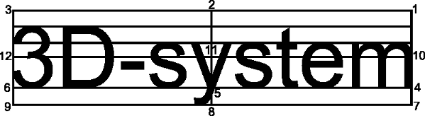

Piirtotyökalut
==============

Käytetettävissä olevat piirtotyökalut.

Piirtotavat
-----------

Kaikki piirtotavat toimivat samalla tavalla. Hiiren painikkeen painaminen määrittää kohteen alkupisteen. Hiiren siirto painike pohjassa siirtää loppupistettä ja piirtää kohdetta reaaliajassa. Painikkeen vapauttaminen luo symboliin uuden kohteen ja aktivoi sen aktiiviseksi kohteeksi.

Kohteen alku- ja loppupisteen on oltava eri paikoissa eli hiiren painikkeen vapauttaminen alkupisteessä ei luo uutta kohdetta.

.. |select image| image:: ../../image/cursor_icon48.png
	:scale: 50 %

|select image| Valitse
^^^^^^^^^^^^^^^^^^^^^^

Valitsee hiirellä osoitetun kohteen aktiiviseksi. Alueet valitaan osoittamalla reunaviivaa ja tekstit osoittamalla kiinnityspistettä.

.. |line image| image:: ../../image/polyline.png
	:scale: 50 %

|line image| Viiva
^^^^^^^^^^^^^^^^^^

Piirtää kahden pisteen viivan. Peräkkäiset kahden pisteen viivat muodostavat murtoviivan ja sulkeminen alkupisteeseen muodostaa alueen.

.. |rect corner image| image:: ../../image/rectangle_corner.png
	:scale: 50 %
.. |rect center image| image:: ../../image/rectangle_center.png
	:scale: 50 %

|rect corner image| Suorakulmio kulmista
^^^^^^^^^^^^^^^^^^^^^^^^^^^^^^^^^^^^^^^^

Piirtää suorakulmion kahden vastakkaisen kulman välille.

|rect center image| Suorakulmio keskeltä
^^^^^^^^^^^^^^^^^^^^^^^^^^^^^^^^^^^^^^^^

Piirtää suorakulmion keskipisteestä kulmaan.

.. |circle corner image| image:: ../../image/circle_corner.png
	:scale: 50 %
.. |circle diameter image| image:: ../../image/circle_diameter.png
	:scale: 50 %
.. |circle center image| image:: ../../image/circle_center.png
	:scale: 50 %

|circle corner image| Ympyrä kulmista
^^^^^^^^^^^^^^^^^^^^^^^^^^^^^^^^^^^^^

Piirtää ympyrän vastakkaisilla kulmilla annetun suorakulmion sisään.

|circle diameter image| Ympyrä halkaisija
^^^^^^^^^^^^^^^^^^^^^^^^^^^^^^^^^^^^^^^^^

Piirtää ympyrän kahden vastakkaisen kehäpisteen välille.

|circle center image| Ympyrä keskeltä
^^^^^^^^^^^^^^^^^^^^^^^^^^^^^^^^^^^^^

Piirtää ympyrän keskipisteestä kehälle.

.. |arc semi image| image:: ../../image/semi_diameter.png
	:scale: 50 %
.. |arc quarter image| image:: ../../image/quarter_radius.png
	:scale: 50 %

.. xxx |arc semi image| Puoliympyrä
.. xxx ^^^^^^^^^^^^^^^^^^^^^^^^^^^^

.. xxx Piirtää puoliympyrän kahden vastakkaisen kehäpisteen välille.

.. xxx |arc quarter image| Neljännesympyrä
.. xxx ^^^^^^^^^^^^^^^^^^^^^^^^^^^^^^^^^^^

.. xxx Piirtää neljännesympyrän keskipisteestä kehälle.

.. |text horizontal image| image:: ../../image/text_horizontal.png
	:scale: 50 %
.. |text rotated image| image:: ../../image/text_rotated.png
	:scale: 50 %

|text horizontal image| Vaakasuora teksti
^^^^^^^^^^^^^^^^^^^^^^^^^^^^^^^^^^^^^^^^^

Piirtää vaakasuoran tekstin osoitettuun kohtaan.

|text rotated image| Käännetty teksti
^^^^^^^^^^^^^^^^^^^^^^^^^^^^^^^^^^^^^

Piirtää tekstin osoitettuun kohtaan käyttäen suuntana toista sijaintia.

Asetukset
---------

Ylemmän rivin asetukset vaikuttavat vain symbolieditoriin. Alemman rivin asetukset tallentuvat symbolin mukana.

Ruudukon tartunta
^^^^^^^^^^^^^^^^^

Ruudukon tartunta editoinnissa.

Viivan leveys
^^^^^^^^^^^^^

Viivan leveys editoinnissa.

Symbolin koko
^^^^^^^^^^^^^

Symbolin koko millimetreinä tai metreinä editoinnissa. Olettaa mittakaavaksi 1:1000. Vaikuttaa tekstien skaalaukseen.

Värin indeksi
^^^^^^^^^^^^^

Värin indeksi 3D-Win kooditaulukon mukaan (``C1``).

Kohteen täyttö
^^^^^^^^^^^^^^

Kohteen täyttötapa.

1. Ei täyttöä, vain alueen reuna piirretään (``F0``)
2. Taustaväri, täyttää koko alueen taustavärillä (``F1``)
3. Alueen täyttö, täyttää koko alueen aktiivisella värillä (``F2``)

Tekstin asemointi
^^^^^^^^^^^^^^^^^

Tekstin kiinnityspisteen sijainti.

1. Ylhäällä oikealla (``J1``)
2. Ylhäällä keskellä (``J2``)
3. Ylhäällä vasemmalla (``J3``)
4. Alareunassa oikealla (``J4``)
5. Alareunassa keskellä (``J5``)
6. Alareunassa vasemmalla (``J6``)
7. Alhaalla oikealla (``J7``)
8. Alhaalla keskellä (``J8``)
9. Alhaalla vasemmalla (``J9``)
10. Puolivälissä oikealla (``J10``)
11. Puolivälissä keskellä (``J11``)
12. Puolivälissä vasemmalla (``J12``)

Tekstin koko
^^^^^^^^^^^^

Tekstin koko ja yksikkö.

*mm*
    Koko millimetreinä, positiivinen arvo (``S2.5``)
*m*
    Koko metreinä, negatiivinen arvo (``S-2.5``)
*%*
    Koko prosentteina symbolin koosta (``P25``)

Teksti
^^^^^^

Teksti symbolissa.

*!*
    Vakioteksti, oletustyyppi (``Teksti``)
*$*
    Ominaisuuden arvo symbolin kohteelta (``$ID``)
*#*
    Makron arvo symbolin kohteelta (``#Z``)
