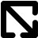

Piirtotyökalut
==============

xxx

Piirtotavat
-----------

Kaikki piirtotavat toimivat samalla tavalla. Hiiren painikkeen painaminen määrittää kohteen alkupisteen. Hiiren siirto painike pohjassa siirtää loppupistettä ja piirtää kohdetta reaaliajassa. Painikkeen vapauttaminen luo symboliin uuden kohteen ja aktivoi sen aktiiviseksi kohteeksi.

Kohteen alku- ja loppupisteen on oltava eri paikoissa eli hiiren painikkeen vapauttaminen alkupisteessä ei luo uutta kohdetta.

.. |select image| image:: ../../image/cursor_icon&48.png
	:scale: 50 %

|select image| Valitse
^^^^^^^^^^^^^^^^^^^^^^

Valitsee hiirellä osoitetun kohteen aktiiviseksi. Alueet valitaan osoittamalla reunaviivaa ja tekstit osoittamalla kiinnityspistettä.

.. |line image| image:: ../../image/polyline.png
	:scale: 50 %

|line image| Viiva
^^^^^^^^^^^^^^^^^^

Piirtää kahden pisteen viivan

.. |rect center image| image:: ../../image/rectangle_center.png
	:scale: 50 %

|rect corner image| Suorakulmio kulmista
^^^^^^^^^^^^^^^^^^^^^^^^^^^^^^^^^^^^^^^^

Piirtää suorakulmion kahden vastakkaisen kulman välille.

|rect center image| Suorakulmio keskeltä
^^^^^^^^^^^^^^^^^^^^^^^^^^^^^^^^^^^^^^^^

Piirtää suorakulmion keskipisteestä kulmaan.

.. |circle corner image| image:: ../../image/circle_corner.png
	:scale: 50 %
.. |circle radius image| image:: ../../image/circle_radius.png
	:scale: 50 %
.. |circle center image| image:: ../../image/circle_center.png
	:scale: 50 %

|circle corner image| Ympyrä kulmista
^^^^^^^^^^^^^^^^^^^^^^^^^^^^^^^^^^^^^

Piirtää ympyrä vastakkaisilla kulmilla annetun suorakulmion sisään.

|circle radius image| Ympyrä halkaisija
^^^^^^^^^^^^^^^^^^^^^^^^^^^^^^^^^^^^^^^

Piirtää ympyrän kahden vastakkaisen kehäpisteen välille.

|circle center image| Ympyrä keskeltä
^^^^^^^^^^^^^^^^^^^^^^^^^^^^^^^^^^^^^

Piirtää ympyrän keskipisteestä kehälle.

.. |arc semi image| image:: ../../image/semi_radius.png
	:scale: 50 %
.. |arc quarter image| image:: ../../image/quarter_radius.png
	:scale: 50 %

|arc semi image| Puoliympyrä
^^^^^^^^^^^^^^^^^^^^^^^^^^^^

xxx

|arc quarter image| Neljännesympyrä
^^^^^^^^^^^^^^^^^^^^^^^^^^^^^^^^^^^

.. |text image| image:: ../../image/text.png
	:scale: 50 %

xxx

|text image| Teksti
^^^^^^^^^^^^^^^^^^^

xxx

Asetukset
---------

xxx

Tartunta
^^^^^^^^

xxx

Täyttö
^^^^^^

xxx

1. Ei täyttöä
2. Taustaväri
3. Alueen täyttö

Viivan leveys
^^^^^^^^^^^^^

Viivan leveys editoinnissa. Ei tallennu symbolin mukana.

Tekstin koko
^^^^^^^^^^^^

Tekstin koko editoinnissa. Ei tallennu symbolin mukana.

Asemointi
^^^^^^^^^

xxx

Teksti
^^^^^^

xxx

